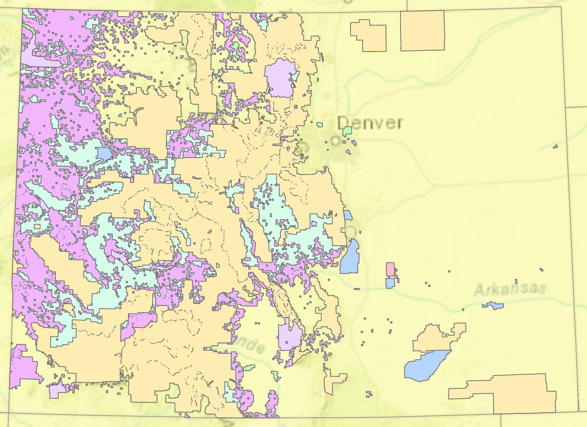

# gis-portfolio
This is my portfolio for the Advanced GIS class!

# About me

I love GIS!

# What I hope to learn

All the things. 

# Portfolio.

Here's where my map examples and other spatial stuff will go...

# Image example

Here's the same image, just a bit smaller using a little HTML: 

## Merge example

**Link to page below**

Here's an example of *how to link* to another page using Markdown.

[Link to other page](/page2.md)

A list: 
* Item 1 
* Item 2

